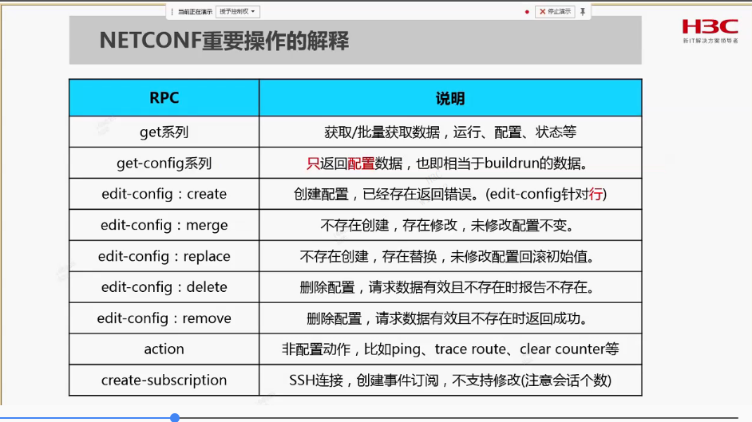
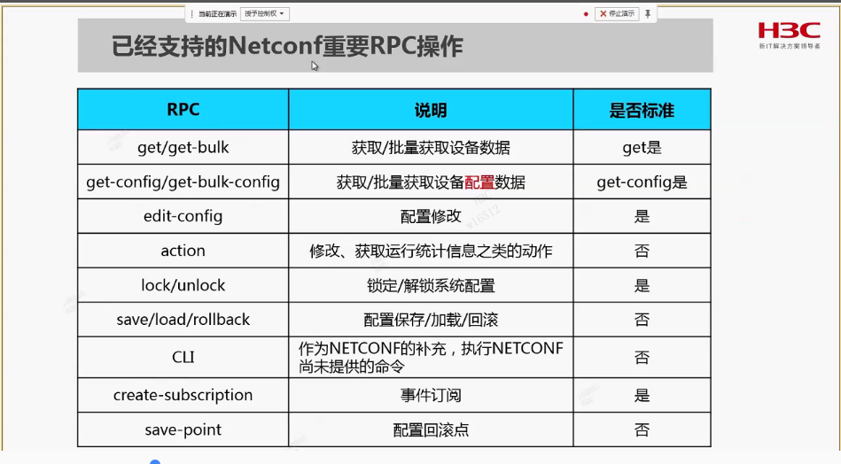

## checklist
1. [~~review liuhui项目代码~~](#check1)
2. P2P实现原理
3. openssl适配dpdk代码学习，dpdk下openssl目录
4. man gcc学习
5. ECDH keygen验证方法，椭圆曲线的理解
6. 什么是SUITE B
7. **利用思维导图，让设计和checklist更加清晰**
8. openssl UI组件是干什么的
9. 问题单助手使用
10. shell使用广度优先算法实现lib依赖
11. 能否基于liuye的python脚本修改，添加支持app查找函数
12. TLS1.3 HKDF是什么
13. asn1格式分析
14. 伪造证书分析，https://github.com/wllm-rbnt/asn1template 工具，改了证书，没改签名，可以用
15. core_translator脚本学习
16. GMT 0009-2012 SM2密码算法使用规范
17. openssl协程完整流程梳理
18. [~~rsa blinding实现原理，解决问题~~](#check18)
19. [~~netconf基本操作~~](#check19)
20. netconf手册和restful编程手册
21. [理出SSL协商中随机数流程，便于后续出调试版本,整理成gdb脚本保存](#check21)
22. [SSL连接和SSL session的关系](#check22)
23. [~~hmac和hash的关系~~](#check23)
24. [~~kmem_cache_alloc_tag怎么使用~~](#check24)
25. [prf是什么](#check25)
26. [~~CCF session栈是怎么使用的~~](#check26)
27. [~~SERVICE_Start 中实例ID是什么概念~~](#check27)
28. [~~openssl代码build_chain和check_chain_extensions理解~~](#check28)
29. [~~openssl BIO是怎么使用的~~](#check29)
30. [~~RSA各填充方式,以及如何check~~](#check30)
31. [~~constant_time openssl这一套接口干什么的~~](#check31)
32. [~~BN_CTX用途~~](#check32)
33. TLS各版本RFC阅读
34. <font face=黑体 color=red size=4>研究TCP，从原理到源码</font>
35. 反向代理和反向链接原理
36. B树、B+树、红黑树、LSM树
37. fips模式向windows CA服务器申请证书解析失败定位
38. <font face="黑体" color=red size=4>openssl状态机完整分析</font>
39. <font face="黑体" color=red size=4>TLS1.0/TLS1.1/TLS1.2/TLS1.3差别分析</font>
40. ipsec/ike流程学习，重点关注转发相关，加解密相关
41. **学习开源较难理解代码，考虑先从开源历史提交记录分析，以openssl ui为例**
42. openssl c_rehash.in 工具什么作用
43. openssl asm怎么实现的，原理


## detail
##### <a id="check1">review liuhui项目代码
review liuhui项目代码     
代码路径：http://10.153.120.80/cmwcode-open/V7R1_SPRINGB75/branches_bugfix/COMWAREV700R001B75D076/TB202209011086/VPN    
lizhiming代码路径：http://10.153.120.80/cmwcode-open/V7R1_SPRINGB75/trunk/VPN  
重点关注点：    
+ _xml_IsakmpProfilesTbl_ProfileConfig lizhiming replace代码   
+ 规则：定制本次功能产品不允许下slot不带subslot
+ 因为两个命令行必须同时存在的， master和slave不能同时相同 
+ 守护进程中是转序的，插件没转序，是否存在问题

##### <a id="check18">rsa blinding实现原理，解决问题</a>
rsa blinding实现原理，解决问题     
参考维基，大意就是我需要对X，进行计算f(X), 但是又不想让对方知道X，先计算E(X)给对方，对方计算f(E(X))返回给我，然后D(f(E(x))) = f(x), 双射 

##### <a id="check19">netconf基本操作</a>




##### netconf手册和restful编程手册
netconf手册和restful编程手册
* get/get_config如果不指定索引列，则走get_bulk
* get/get_config如果只指定索引列，则所有MOR都带
* get/get_config如果指定MOR,则只处理对应MOR配制

##### <a id="check21">理出SSL协商中随机数流程，便于后续出调试版本,整理成gdb脚本保存</a>
www

##### <a id="check22">SSL连接和SSL session的关系</a>
一个session可以对应多个连接，保存session数据，建立连接时设置上可以复用会话

##### <a id="check23">hmac和hash的关系</a>
HMAC(K, text) =  HASH(K XOR opad, HASH(K XOR ipad, text))

##### <a id="check24">kmem_cache_alloc_tag怎么使用</a>
* kmem_cache_alloc_tag 仅仅创建一个描述slab缓冲池布局的数据结构，并没有从伙伴系统申请内存
* 优点   
   1. 更少的内存消耗,比如可以预定义5K object，但是kmalloc则只能8K
   2. 错误只会影响本cache，且更容易定位
   3. 可自定义初始化

##### <a id="check25">prf是什么</a>
* TLS1.0/1.1/1.2 使用PRF进行key derive, TLS1.3 使用HKDF
* PRF计算
   * TLS1.0/1.1 r1=P_MD5(), r2=P_SHA1(), r =r1 xor r2
   * TLS1.2 r=P_SHA256() 或 r=P_SHA384()
* RPF在TLS协议中运用
   * 计算主密钥时 secret是"master secret" + client_random + server_random, seed是pre_master_secret, 输出master secret, 48字节
   * 计算对称密钥(key material)时 secret是"key expansion" + server_random+client_random,seed是master secret, 输出是key block， 字节长度与选中套件有关
   * 计算finish时，secret是"client/server finished"，<font face="黑体" color=red size=5>Seed是握手的hash值</font>(待确认), 输出是12字节的值


##### <a id="check26">CCF session栈是怎么使用的</a>
1. 可以使用session id（hash查找优点）
2. 通过a[1]=2, a[2]=6连接，类似链表(链表插入优点)

##### <a id="check26">SERVICE_Start 中实例ID是什么概念</a>
* 我们使用进程名process name（有时，我们把进程也称为服务service）代表进程的所有实例。使用实例ID区分相同进程名的不同实例，VPN大多都不关系，没指定或0，见SCM编程手册
* #define SERVICE_DEFAULT_INSTANCEID   0 /* 默认实例ID */
* #define SERVICE_INVALID_INSTANCEID   (0xFFFFFFFF) /* 使用该宏时，表示操作服务的所有实例 */ 

##### <a id="check28">openssl代码build_chain和check_chain_extensions理解</a>
build_chain
```
初始值：
ctx->ctx = store           (ssl->ctx->store)
ctx->cert = x509
ctx->untrusted = chain
ctx->num_untrusted = 0
ctx->chain = NULL
1.
search = DOUNTRUSTED
ctx->chain  push x509
ctx->num_untrusted = 1
sktmp = dup(ctx->untrusted)
取 ctx->chain栈顶，从sktmp找issuer, xtmp
ctx->chain push xtmp
ctx->num_untrusted = 2
2.
继续遍历untrust
3. 如果untrust没有，则在trust找一下
找到的都放到ctx->chain中
```
check_chain_extensions
```
第一个为local, must be ca = -1
后面的must be ca = 1
```

##### <a id="check29">openssl BIO是怎么使用的</a>
BIO可以连接，bio1->next = bio2, bio2->next=bio3，数据会先从bio1经过，然后bio2, bio3，比如bio1是编码， bio2是加密,bio3是socket发送；打印应该可以将bio数据dup到标准输出对应bio，需要时再看下代码 

##### <a id="check30">RSA各填充方式,以及如何check</a>
* 加解密:OAEP/PKCS随机数
* 签名：PSS随机, PKCS固定

##### <a id="check31">constant_time openssl这一套接口干什么的</a>
固定时间计算，没什么特殊，主要比较大小等，每个bit计算，防止旁道攻击

##### <a id="check32">BN_CTX用途</a>
* 由于BIGNUM动态内存分配和重复子程序调用，开销较大，所以做临时缓存，只能单线程使用    
* BN_CTX_DEBUG 打印 ==> ^^^表示栈起始位置，" "表示函数栈内
* 两个核心结构:
   * BN_POOL：在创建BN_CTX的内存，都缓存起来，通过链表连接，current指针指向当前分配到的地方
   * BN_STACK: 用于记录每一级函数起始BIGNUM所占POOL中索引，便于函数调用BN_CTX_end时释放对应内存给pool
* 优点:
   * 当前程序和其子程序间共用分配的内存，不用释放再重新申请
   * 获取BIGNUM时，不需要分配关注每个BIGNUM的释放


